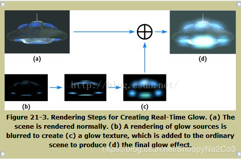
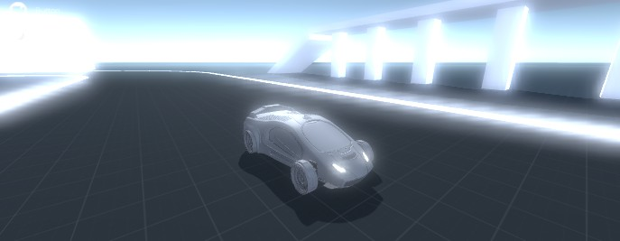
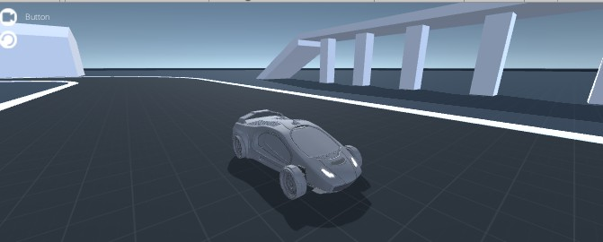
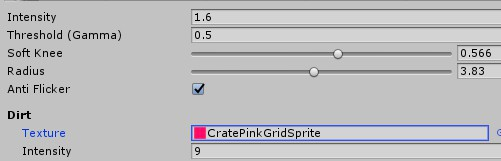
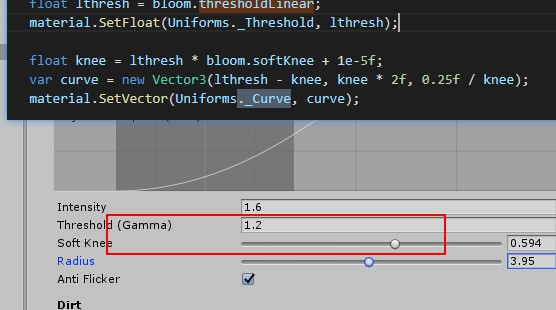
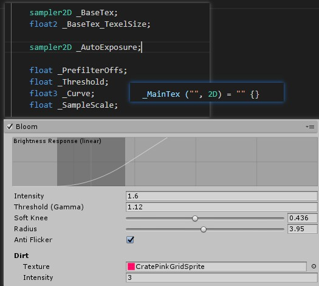

### 说明

* 一般来说理解是基于下面这张图 




主要是对于高亮部分进行模糊操作  

   
下面来学习关于unity 中的描述     
 



  
具体操作界面  



  
可以看到 在shade 开始是传入3个纹理  

``` code
        _MainTex ("", 2D) = "" {}
        _BaseTex ("", 2D) = "" {}
        _AutoExposure ("", 2D) = "" {}
```

用到了一个函数  

``` code
            o.uvMain = UnityStereoScreenSpaceUVAdjust(v.texcoord.xy, _MainTex_ST);
```

宏定义中 之类有两个返回，根据上下文这里采用的是返回float2     
``` c++ 
#define UnityStereoScreenSpaceUVAdjust(x, y) UnityStereoScreenSpaceUVAdjustInternal(x, y)

``` 
``` c++

inline float2 UnityStereoScreenSpaceUVAdjustInternal(float2 uv, float4 scaleAndOffset)
{
    return uv.xy * scaleAndOffset.xy + scaleAndOffset.zw;
}
```

这里是渲染流程后处理阶段， 传入的MainTex 本身应该就是rt   
后续通过设置平面坐标系 完成相应的设置，这里是完成顶点部分uv 设置   
``` c++ 
o. uvMain = UnityStereoScreenSpaceUVAdjust(v. texcoord. xy, _MainTex_ST); 
o. uvBase = o. uvMain; 

#if UNITY_UV_STARTS_AT_TOP
if (_BaseTex_TexelSize. y < 0. 0)

    o.uvBase.y = 1.0 - o.uvBase.y;

#endif

``` 

### 像素阶段函数   

这里解释是 自动曝光，使用顶点阶段计算的uv 采样曝光图 使用r通道， 然后对于图片进行 采样并曝光   
代码中找到可以知道其实这部分操作应该是设置的   
```c++
 internal static readonly int _AutoExposure        = Shader.PropertyToID("_AutoExposure");

```

``` c++ 

        half4 FetchAutoExposed(sampler2D tex, float2 uv)
        {
            float autoExposure = 1.0;
            uv = UnityStereoScreenSpaceUVAdjust(uv, _MainTex_ST);
            autoExposure = tex2D(_AutoExposure, uv).r;
            return tex2D(tex, uv) * autoExposure;
        }

``` 

在说明获取采样高亮部分需要知道一些参数    

设置高动态安全范围,最高数值是 65504   
```c++
// Clamp HDR value within a safe range
inline half  SafeHDR(half  c) { return min(c, HALF_MAX); }
inline half2 SafeHDR(half2 c) { return min(c, HALF_MAX); }
inline half3 SafeHDR(half3 c) { return min(c, HALF_MAX); }
inline half4 SafeHDR(half4 c) { return min(c, HALF_MAX); }

```
计算三个数值的中间数值    
因为是float3类型所以可能会出现不一样的 数据情况，比如[0.2,0.9,0.5]类似这样的数值会拆分从组和  
``` c++ 
// 3-tap median filter
half3 Median(half3 a, half3 b, half3 c)
{
    return a + b + c - min(min(a, b), c) - max(max(a, b), c);
}
```
对于曝光图采样， 有两种处理方法  一种是防止闪烁   
采用5次采样处理方案 
```c++ 
        #if ANTI_FLICKER
            float3 d = _MainTex_TexelSize.xyx * float3(1.0, 1.0, 0.0);
            half4 s0 = SafeHDR(FetchAutoExposed(_MainTex, uv));
            half3 s1 = SafeHDR(FetchAutoExposed(_MainTex, uv - d.xz).rgb);
            half3 s2 = SafeHDR(FetchAutoExposed(_MainTex, uv + d.xz).rgb);
            half3 s3 = SafeHDR(FetchAutoExposed(_MainTex, uv - d.zy).rgb);
            half3 s4 = SafeHDR(FetchAutoExposed(_MainTex, uv + d.zy).rgb);
            half3 m = Median(Median(s0.rgb, s1, s2), s3, s4);
        #else
            half4 s0 = SafeHDR(FetchAutoExposed(_MainTex, uv));
            half3 m = s0.rgb;
        #endif

```
设计到色彩空间转换使用的是unity的底部操作   
```c++ 
inline half3 GammaToLinearSpace (half3 sRGB)
{
    // Approximate version from http://chilliant.blogspot.com.au/2012/08/srgb-approximations-for-hlsl.html?m=1
    return sRGB * (sRGB * (sRGB * 0.305306011h + 0.682171111h) + 0.012522878h);

    // Precise version, useful for debugging.
    //return half3(GammaToLinearSpaceExact(sRGB.r), GammaToLinearSpaceExact(sRGB.g), GammaToLinearSpaceExact(sRGB.b));
}
inline half3 LinearToGammaSpace (half3 linRGB)
{
    linRGB = max(linRGB, half3(0.h, 0.h, 0.h));
    // An almost-perfect approximation from http://chilliant.blogspot.com.au/2012/08/srgb-approximations-for-hlsl.html?m=1
    return max(1.055h * pow(linRGB, 0.416666667h) - 0.055h, 0.h);

    // Exact version, useful for debugging.
    //return half3(LinearToGammaSpaceExact(linRGB.r), LinearToGammaSpaceExact(linRGB.g), LinearToGammaSpaceExact(linRGB.b));
}
```
亮度提取函数  
``` c++ 
// Brightness function
half Brightness(half3 c)
{
    return Max3(c);
}
max3 定义取出颜色的最大定义在common中有定义  
inline half Max3(half3 x) { return max(x.x, max(x.y, x.z)); }
inline half Max3(half x, half y, half z) { return max(x, max(y, z)); }
```

到这里可以把亮度像素过滤函数加回来    
```c++  
 half4 FragPrefilter(VaryingsDefault i) : SV_Target
        {
            float2 uv = i.uv + _MainTex_TexelSize.xy * _PrefilterOffs;

        #if ANTI_FLICKER
            float3 d = _MainTex_TexelSize.xyx * float3(1.0, 1.0, 0.0);
            half4 s0 = SafeHDR(FetchAutoExposed(_MainTex, uv));
            half3 s1 = SafeHDR(FetchAutoExposed(_MainTex, uv - d.xz).rgb);
            half3 s2 = SafeHDR(FetchAutoExposed(_MainTex, uv + d.xz).rgb);
            half3 s3 = SafeHDR(FetchAutoExposed(_MainTex, uv - d.zy).rgb);
            half3 s4 = SafeHDR(FetchAutoExposed(_MainTex, uv + d.zy).rgb);
            half3 m = Median(Median(s0.rgb, s1, s2), s3, s4);
        #else
            half4 s0 = SafeHDR(FetchAutoExposed(_MainTex, uv));
            half3 m = s0.rgb;
        #endif
// 取出图进行曝光处理  
        #if UNITY_COLORSPACE_GAMMA
            m = GammaToLinearSpace(m);
        #endif
/// 根据引擎设置确定转到线性空间处理  
            // Pixel brightness
            half br = Brightness(m);
/// 取得像素的最大亮度  

            // Under-threshold part: quadratic curve
            half rq = clamp(br - _Curve.x, 0.0, _Curve.y);
            rq = _Curve.z * rq * rq;

            // Combine and apply the brightness response curve.
            m *= max(rq, br - _Threshold) / max(br, 1e-5);

            return EncodeHDR(m);
        }
```
关于curve 传入 和这里有关系     
  
其实通过显示曲线世可以看出来的，本身亮度减去阈值，同时限制在 亮度的两边中最后， 两倍后  、
最后吧亮度曲线*颜色 

如果高动态编码成rgbm 如果世底动态实际输出  
```c++ 
half4 EncodeHDR(float3 rgb)
{
#if USE_RGBM
    rgb *= 1.0 / 8.0;
    float m = max(max(rgb.r, rgb.g), max(rgb.b, 1e-6));
    m = ceil(m * 255.0) / 255.0;
    return half4(rgb / m, m);
#else
    return half4(rgb, 0.0);
#endif
}

float3 DecodeHDR(half4 rgba)
{
#if USE_RGBM
    return rgba.rgb * rgba.a * 8.0;
#else
    return rgba.rgb;
#endif
}

```
在我自己库中有单独说 但是这里是关于hdr问题  **HDR文件格式简介 - CSDN博客---rgbe格式rgb格式转换----**   
[rgbm](http://www.xionggf.com/post/cg/inside_hdr/)  
可以看到选择范围是不同的这里使用的是 6  
[rgbm]([https://link](http://graphicrants.blogspot.com/2009/04/rgbm-color-encoding.html))  


### 下面熟手降采样   

使用的函数  
```c++ 

        half4 FragDownsample1(VaryingsDefault i) : SV_Target
        {
        #if ANTI_FLICKER
            return EncodeHDR(DownsampleAntiFlickerFilter(_MainTex, i.uvSPR, _MainTex_TexelSize.xy));
        #else
            return EncodeHDR(DownsampleFilter(_MainTex, i.uvSPR, _MainTex_TexelSize.xy));
        #endif
        }
```
使用到的是box采样，注意采样4次  
[浅陌文章](https://zhuanlan.zhihu.com/p/125744132)  
关于这部分还是不是很清楚 ，但是进行一次模糊  

```c++ 
// Downsample with a 4x4 box filter
half3 DownsampleFilter(sampler2D tex, float2 uv, float2 texelSize)
{
    float4 d = texelSize.xyxy * float4(-1.0, -1.0, 1.0, 1.0);

    half3 s;
    s = DecodeHDR(tex2D(tex, uv + d.xy));
    s += DecodeHDR(tex2D(tex, uv + d.zy));
    s += DecodeHDR(tex2D(tex, uv + d.xw));
    s += DecodeHDR(tex2D(tex, uv + d.zw));

    return s * (1.0 / 4.0);
}
```
这里可以进行两次
```c++
        half4 FragDownsample2(VaryingsDefault i) : SV_Target
        {
            return EncodeHDR(DownsampleFilter(_MainTex, i.uvSPR, _MainTex_TexelSize.xy));
        }
```

最后一次是基础+ 模糊进行合并  
```c++ 
        half4 FragUpsample(VaryingsMultitex i) : SV_Target
        {
            half3 base = DecodeHDR(tex2D(_BaseTex, i.uvBase));
            half3 blur = UpsampleFilter(_MainTex, i.uvMain, _MainTex_TexelSize.xy, _SampleScale);
            return EncodeHDR(base + blur);
        }
```
```c++
half3 UpsampleFilter(sampler2D tex, float2 uv, float2 texelSize, float sampleScale)
{
#if MOBILE_OR_CONSOLE
    // 4-tap bilinear upsampler
    float4 d = texelSize.xyxy * float4(-1.0, -1.0, 1.0, 1.0) * (sampleScale * 0.5);

    half3 s;
    s =  DecodeHDR(tex2D(tex, uv + d.xy));
    s += DecodeHDR(tex2D(tex, uv + d.zy));
    s += DecodeHDR(tex2D(tex, uv + d.xw));
    s += DecodeHDR(tex2D(tex, uv + d.zw));

    return s * (1.0 / 4.0);
#else
    // 9-tap bilinear upsampler (tent filter)
    float4 d = texelSize.xyxy * float4(1.0, 1.0, -1.0, 0.0) * sampleScale;

    half3 s;
    s =  DecodeHDR(tex2D(tex, uv - d.xy));
    s += DecodeHDR(tex2D(tex, uv - d.wy)) * 2.0;
    s += DecodeHDR(tex2D(tex, uv - d.zy));

    s += DecodeHDR(tex2D(tex, uv + d.zw)) * 2.0;
    s += DecodeHDR(tex2D(tex, uv))        * 4.0;
    s += DecodeHDR(tex2D(tex, uv + d.xw)) * 2.0;

    s += DecodeHDR(tex2D(tex, uv + d.zy));
    s += DecodeHDR(tex2D(tex, uv + d.wy)) * 2.0;
    s += DecodeHDR(tex2D(tex, uv + d.xy));

    return s * (1.0 / 16.0);
#endif
}
```
统一使用的vs顶点函数    
这里使用了完整的uv 顶点阶段shader，这里理解是模型变换的标准坐标中，所以这里可以使用顶点loacluv当作屏幕空间uv 
```c++
VaryingsDefault VertDefault(AttributesDefault v)
{
    VaryingsDefault o;
    o.pos = UnityObjectToClipPos(v.vertex);
    o.uv = v.texcoord.xy;
    o.uvSPR = UnityStereoScreenSpaceUVAdjust(v.texcoord.xy, _MainTex_ST);
    return o;
}
```

具体引用过程， get亮度 进行两次降采样，每次都是用box过滤 完成4x4模糊最后合并   
```c++
        ZTest Always Cull Off ZWrite Off

        Pass
        {
            CGPROGRAM
                #pragma multi_compile __ ANTI_FLICKER
                #pragma multi_compile __ UNITY_COLORSPACE_GAMMA
                #pragma vertex VertDefault
                #pragma fragment FragPrefilter
            ENDCG
        }

        Pass
        {
            CGPROGRAM
                #pragma multi_compile __ ANTI_FLICKER
                #pragma vertex VertDefault
                #pragma fragment FragDownsample1
            ENDCG
        }

        Pass
        {
            CGPROGRAM
                #pragma vertex VertDefault
                #pragma fragment FragDownsample2
            ENDCG
        }

        Pass
        {
            CGPROGRAM
                #pragma vertex VertMultitex
                #pragma fragment FragUpsample
            ENDCG
        }
```
## 下面来关联对那个的程序  
主要说的就是shader中的程序是如何和界面操作关联的  
  

```c++
        _MainTex
        sampler2D _BaseTex;
        float2 _BaseTex_TexelSize;

        sampler2D _AutoExposure;

        float _PrefilterOffs;
        float _Threshold;
        float3 _Curve;
        float _SampleScale;
```
在BloomComponent中有相关的定义  
在get 出来第一个类中可以看到相关的设置get   
```c++
        static class Uniforms
        {
            internal static readonly int _AutoExposure        = Shader.PropertyToID("_AutoExposure");
            internal static readonly int _Threshold           = Shader.PropertyToID("_Threshold");
            internal static readonly int _Curve               = Shader.PropertyToID("_Curve");
            internal static readonly int _PrefilterOffs       = Shader.PropertyToID("_PrefilterOffs");
            internal static readonly int _SampleScale         = Shader.PropertyToID("_SampleScale");
            internal static readonly int _BaseTex             = Shader.PropertyToID("_BaseTex");
            internal static readonly int _BloomTex            = Shader.PropertyToID("_BloomTex");
            internal static readonly int _Bloom_Settings      = Shader.PropertyToID("_Bloom_Settings");
            internal static readonly int _Bloom_DirtTex       = Shader.PropertyToID("_Bloom_DirtTex");
            internal static readonly int _Bloom_DirtIntensity = Shader.PropertyToID("_Bloom_DirtIntensity");
        }
```
里面有关于 _AutoExposure  _Threshold  _Curve  _PrefilterOffs _BaseTex  设置  

在预处理函数开头就实例化了ui 和 get了材质相关函数   
```c++
            var bloom = model.settings.bloom;
            var lensDirt = model.settings.lensDirt;
            var material = context.materialFactory.Get("Hidden/Post FX/Bloom");
            material.shaderKeywords = null;
```
mode 定义  
```c++
    public abstract class PostProcessingComponent<T> : PostProcessingComponentBase
        where T : PostProcessingModel
    {
        public T model { get; internal set; }

        public virtual void Init(PostProcessingContext pcontext, T pmodel)
        {
            context = pcontext;
            model = pmodel;
        }

        public override PostProcessingModel GetModel()
        {
            return model;
        }
    }
```
settings 这里是调用了独立的结构处理    
```c++
        public struct Settings
        {
            public BloomSettings bloom;
            public LensDirtSettings lensDirt;

            public static Settings defaultSettings
            {
                get
                {
                    return new Settings
                    {
                        bloom = BloomSettings.defaultSettings,
                        lensDirt = LensDirtSettings.defaultSettings
                    };
                }
            }
        }
```
关于 bloom setinging   和 LensDirtSettings 是 对应的是unity 后处理一个可视化模块就是上面截图那样   
两个模块都进行了序列操作 这里就是界面了
```c++
public class BloomModel : PostProcessingModel
    {
        [Serializable]
        public struct BloomSettings
        {
            [Min(0f), Tooltip("Strength of the bloom filter.")]
            public float intensity;

            [Min(0f), Tooltip("Filters out pixels under this level of brightness.")]
            public float threshold;

            public float thresholdLinear
            {
                set { threshold = Mathf.LinearToGammaSpace(value); }
                get { return Mathf.GammaToLinearSpace(threshold); }
            }

            [Range(0f, 1f), Tooltip("Makes transition between under/over-threshold gradual (0 = hard threshold, 1 = soft threshold).")]
            public float softKnee;

            [Range(1f, 7f), Tooltip("Changes extent of veiling effects in a screen resolution-independent fashion.")]
            public float radius;

            [Tooltip("Reduces flashing noise with an additional filter.")]
            public bool antiFlicker;

            public static BloomSettings defaultSettings
            {
                get
                {
                    return new BloomSettings
                    {
                        intensity = 0.5f,
                        threshold = 1.1f,
                        softKnee = 0.5f,
                        radius = 4f,
                        antiFlicker = false,
                    };
                }
            }
        }

        [Serializable]
        public struct LensDirtSettings
        {
            [Tooltip("Dirtiness texture to add smudges or dust to the lens.")]
            public Texture texture;

            [Min(0f), Tooltip("Amount of lens dirtiness.")]
            public float intensity;

            public static LensDirtSettings defaultSettings
            {
                get
                {
                    return new LensDirtSettings
                    {
                        texture = null,
                        intensity = 3f
                    };
                }
            }
        }
```

设置第一个纹理自动曝光 是上面预处理函数传递过来的  

```c++
material.SetTexture(Uniforms._AutoExposure, autooExposure);
public void Prepare(RenderTexture source, Material uberMaterial, Texture autoExposure)
```
关于与该类调用在  UnityEngine.PostProcessing中有说明  
如果激活就会执行该函数传递进去的是一张白色图,通过下面就找到了来源 

```c++
            Texture autoExposure = GraphicsUtils.whiteTexture;
            if (m_EyeAdaptation.active)
            {
                uberActive = true;
                autoExposure = m_EyeAdaptation.Prepare(src, uberMaterial);
            }

            uberMaterial.SetTexture("_AutoExposure", autoExposure);
            if (m_Bloom.active)
            {
                uberActive = true;
                m_Bloom.Prepare(src, uberMaterial, autoExposure);
            }
```
关于 GraphicsUnitls 也是引擎基础后处理   
默认还是创建一张白图  
```c++
        public static Texture2D whiteTexture
        {
            get
            {
                if (s_WhiteTexture != null)
                    return s_WhiteTexture;

                s_WhiteTexture = new Texture2D(1, 1, TextureFormat.ARGB32, false);
                s_WhiteTexture.SetPixel(0, 0, new Color(1f, 1f, 1f, 1f));
                s_WhiteTexture.Apply();

                return s_WhiteTexture;
            }
        }
```

在bloomshader关于高动态处理 在手机上不应用 在这里有定义   

```c++
            // TODO: Extend the use of RGBM to the whole chain for mobile platforms
            var useRGBM = Application.isMobilePlatform;
            var rtFormat = useRGBM
                ? RenderTextureFormat.Default
                : RenderTextureFormat.DefaultHDR;
```
采样rt 进行缩放  
```c++
            // Do bloom on a half-res buffer, full-res doesn't bring much and kills performances on
            // fillrate limited platforms
            var tw = context.width / 2;
            var th = context.height / 2;
```
关于阈值的设置   
在对应结构中可以看到  get { return Mathf.GammaToLinearSpace(threshold); } 进行了一个现在转换操作  
```c++
            // Uupdate the shader properties
            float lthresh = bloom.thresholdLinear;
            material.SetFloat(Uniforms._Threshold, lthresh);
```
关于curve设置在shader最后有使用这里是使用了一个曲线   
```c++
  float knee = lthresh * bloom.softKnee + 1e-5f;
            var curve = new Vector3(lthresh - knee, knee * 2f, 0.25f / knee);
            material.SetVector(Uniforms._Curve, curve);
```
偏移值设置  
```c++
 material.SetFloat(Uniforms._PrefilterOffs, bloom.antiFlicker ? -0.5f : 0f);
```
采样缩放  
通过定义可以知道bloom 半径总是小于8 
```c++
            var tw = context.width / 2;
            var th = context.height / 2;
            float logh = Mathf.Log(th, 2f) + bloom.radius - 8f;
            int logh_i = (int)logh;
            float sampleScale = 0.5f + logh - logh_i;
            material.SetFloat(Uniforms._SampleScale, sampleScale);

// 其实就是视口长和宽了
         public int width
        {
            get { return camera.pixelWidth; }
        }

        public int height
        {
            get { return camera.pixelHeight; }
        }
```
get 设置rt  
```c++
            // Prefilter pass
            var prefiltered = context.renderTextureFactory.Get(tw, th, 0, rtFormat);
            Graphics.Blit(source, prefiltered, material, 0);
```

到这里只是对整个流程做了一个初步的认识，关于到底是怎么处理关系还需要 进一步研究实现  
